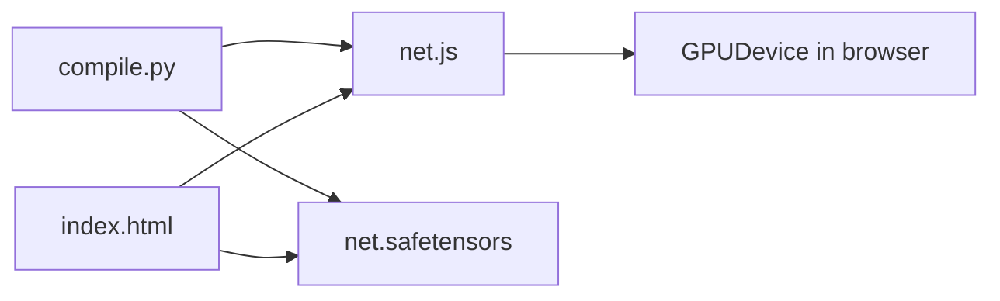

# tinygrad YOLOv8 WebGPU (compile + browser)

## End-to-end flow

1. **Compile (Python, host machine)** — `examples/webgpu/yolov8/compile.py` builds two artifacts next to `index.html`:
   - **`net.js`** — ES module: WGSL compute pipelines + `load()` + callable network.
   - **`net.safetensors`** — weights in [SafeTensors](https://github.com/huggingface/safetensors) layout for the browser to `fetch`.
2. **Run (browser)** — Serve the directory over **HTTP** (ES modules and `fetch` break on `file://`). Open `index.html`. The page uses the **browser WebGPU API** (`navigator.gpu`), not Python.



## What `compile.py` does

Path: `examples/webgpu/yolov8/compile.py`.

- Sets **`DEV` to `WEBGPU`** so the default device is WebGPU. The export run traces and lowers kernels with the **WGSL** renderer (same device family as the emitted `net.js`).
- Builds **`YOLOv8`** (`w/r/d` for variant `n`), loads weights via `get_weights_location('n')` (may download `yolov8n.safetensors` under the repo `weights/` tree per `examples/yolov8.py`).
- Calls **`export_model(model, Device.DEFAULT.lower(), Tensor.randn(1,3,640,640), model_name="yolov8")`** from `extra/export_model.py`:
  - **`jit_model`** runs the forward twice to capture the graph.
  - **`target == "webgpu"`** emits the big string written to **`net.js`** (WGSL shader sources as template strings, pipeline setup, buffer I/O).
- **`safe_save(state, ... "net.safetensors")`** writes tensor state for the browser.

**Host requirement for compile:** the **WebGPU runtime in Python** must load (Dawn native library). The `pydawn` package ships per-arch `libwebgpu_dawn_*.dylib` / `.so` / `.dll` under `site-packages/pydawn/lib/`. If loading fails, see `docs/runtime.md` (WEBGPU) and optional **`WEBGPU_PATH`**.

**Inputs/outputs contract:** export uses a dummy input shape **`(1, 3, 640, 640)`** — the page must feed the same logical layout (CHW float32 normalized [0,1]).

## What `net.js` is (generated)

- Default export is a **default ES module** object with:
  - **`load(device, weight_path)`** — `fetch`es `weight_path`, parses SafeTensors metadata, builds GPU buffers and compute pipelines.
  - The function returned by `load` implements **one forward**: upload input, dispatch compute, read outputs.
- Shader code is **WGSL** embedded as JS template strings; compute workgroup sizes match what was captured at export time.

Do not hand-edit `net.js` for routine changes; fix the model or re-run `compile.py`.

## `index.html` structure

Path: `examples/webgpu/yolov8/index.html`.

### 1. Load the compiled module (top of file)

```html
<script type="module">
    import yolov8 from "./net.js"
    window.yolov8 = yolov8;
</script>
```

`type="module"` is required. The inline block that follows (camera + loop) is classic script; it uses **`window.yolov8`** after the module assigns it.

### 2. WebGPU device (inline script)

```javascript
const getDevice = async () => {
    if (!navigator.gpu) return false;
    const adapter = await navigator.gpu.requestAdapter();
    return await adapter.requestDevice({ powerPreference: "high-performance" });
};
```

If `navigator.gpu` is missing, the page shows the **WebGPU not supported** message. Device creation is **browser WebGPU**, independent of Python.

### 3. First inference: `load` then forward

```javascript
net = await yolov8.load(device, "./net.safetensors");
// ...
const output = await net(new Float32Array(input));
```

- **`load`** must complete once (lazy init in `detectObjectsOnFrame`).
- **`net(...)`** expects a **flat Float32Array** in **CHW** order: all R, then all G, then all B over the 640×640 crop (see `prepareInput`).

### 4. Preprocessing matches training-style input

`prepareInput` reads **640×640** `ImageData`, scales **letterboxed** video into that square, then builds CHW floats divided by 255. That matches the usual NCHW 1×3×640×640 layout expected by the exported graph.

### 5. Post-processing and draw

`output[0]` is flattened model output; the loop interprets groups of 6 values as box + score + class (see the `for (let i = 0; i < boxes.length; i += 6)` and `validBoxes` filter). **COCO-style** class names live in `yolo_classes`; colors are generated in HSL.

## Operations checklist

| Step | Command / action |
|------|------------------|
| Compile | From repo root: `PYTHONPATH=. python3 examples/webgpu/yolov8/compile.py` |
| Serve | `cd examples/webgpu/yolov8 && python3 -m http.server 8765` (or any static server) |
| Open | Browser with WebGPU (e.g. Chrome/Edge), `http://localhost:8765/` |

## File roles (in `examples/webgpu/yolov8/`)

| File | Role |
|------|------|
| `compile.py` | Export pipeline; writes `net.js` + `net.safetensors` |
| `net.js` | Generated module (WGSL + loaders); **regenerated by compile** |
| `net.safetensors` | Generated weights for `fetch` in the browser |
| `index.html` | UI: camera, 640px letterbox, CHW input, `load` + `net()`, overlay draw |

## Optional deep reference

- Export implementation: `extra/export_model.py` — `export_model`, `export_model_webgpu`, `jit_model`, `compile_net`.
- YOLO architecture / weights: `examples/yolov8.py`.
- WebGPU runtime (Python): `tinygrad/runtime/ops_webgpu.py`, `docs/runtime.md`.
